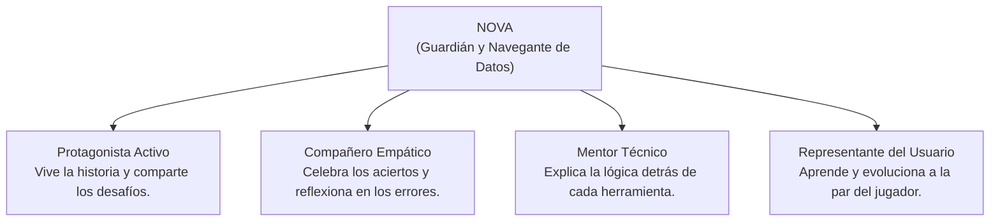

# LEARN-LAB — 01. VISIÓN DEL PRODUCTO

---

## 1. IDENTIDAD DE LEARN-LAB

### ¿Qué es Learn-Lab?
Learn-Lab es una **plataforma interactiva de aprendizaje tecnológico basada en aventura, estrategia y narrativa evolutiva**. A través de la simulación de una civilización en crecimiento, los usuarios aprenden y aplican conceptos reales de SQL, Análisis de Datos, Programación en Python, Machine Learning e Inteligencia Artificial en entornos de ejecución prácticos.

### ¿Qué problema resuelve?
Las plataformas educativas tradicionales sufren de dos extremos contraproducentes:
1. **La esterilidad del aula digital:** Cursos en video pasivos, formularios de opción múltiple descontextualizados y ejercicios repetitivos donde el estudiante nunca entiende el *porqué* de una tecnología.
2. **La gamificación superficial:** Sistemas de puntos, barras de progreso y fuegos artificiales que no guardan relación con el contenido pedagógico y que tratan al estudiante adulto como un receptor pasivo.

Learn-Lab resuelve esto integrando la **mecánica de juego con la naturaleza del conocimiento**: el conocimiento técnico existe en el mundo real porque resuelve problemas reales de supervivencia, coordinación, economía y descubrimiento. Al situar cada concepto en ese arco de necesidad humana, el aprendizaje se vuelve memorable, significativo e intuitivo.

### ¿Qué sensación debe generar?
Al interactuar con Learn-Lab, el usuario debe experimentar:
* **Asombro y descubrimiento:** *"¡Ah! Para esto se inventó un JOIN: porque tener todo en una sola tabla hacía colapsar la logística de la ciudad."*
* **Poder y agencia:** Sentir que cada consulta SQL o script de Python no es solo texto en una pantalla, sino una herramienta tangible que desbloquea recursos, salva expediciones y moderniza comunidades.
* **Curiosidad continua:** Una anticipación constante por saber qué desafío narrativo y qué era histórica sigue a continuación.

### ¿Qué lo diferencia de plataformas convencionales?
| Plataforma Tradicional | Learn-Lab |
| :--- | :--- |
| Enseña sintaxis abstracta aislada. | Enseña herramientas en el momento exacto en que la civilización las necesita. |
| Entornos de ejercicio tipo formulario. | Laboratorios contextualizados integrados en la narrativa del mapa. |
| Recompensas puramente numéricas (+10 XP). | Transformación física visible del mapa y del asentamiento. |
| Experiencia solitaria o de examen. | Acompañamiento empático junto a Nova y personajes con voz propia. |

---

## 2. FILOSOFÍA PEDAGÓGICA

> **"Aprender no es memorizar respuestas prefabricadas; es descubrir la palanca que mueve el mundo."**

La filosofía de Learn-Lab se fundamenta en cinco pilares pedagógicos:
1. **Descubrir antes que memorizar:** El usuario se enfrenta primero a una necesidad tangible (ej. contar manualmente 500 sacos de trigo) antes de que se le entregue la herramienta (`COUNT(*) / SUM()`).
2. **Construir y experimentar:** El código se escribe en vivo. Los errores no son castigos punitivos, sino hipótesis que no funcionaron y que entregan retroalimentación guiada para afinar el pensamiento lógico.
3. **Progresión por competencia real:** No se avanza por tiempo transcurrido, sino por resolver el desafío con consultas que producen los datos correctos en el motor de base de datos.
4. **Respeto a la inteligencia del estudiante:** Ya sea un estudiante joven o un profesional adulto, el tono nunca es condescendiente ni infantil. El diseño es accesible y cálido, pero intelectualmente estimulante.

---

## 3. LA FANTASÍA DEL USUARIO

La promesa emocional de Learn-Lab al usuario es:
> **"Comenzarás como un superviviente sin herramientas en medio de la naturaleza primitiva, y terminarás como un arquitecto capaz de gobernar datos, automatizar industrias e interactuar con Inteligencia Artificial para restaurar el futuro."**

El usuario no es un espectador que lee sobre historia o tecnología: es el **ingeniero del destino**. Cada línea de código que domina acelera la evolución de la civilización.

---

## 4. EL ROL DE NOVA

**Nova** no es una simple mascota decorativa en una esquina de la pantalla. Nova encarna múltiples funciones críticas para la experiencia:

### Características de Nova:
* **Humilde pero brillante:** Sabe que en su futuro las cosas funcionaban, pero al perder sus bases de datos debe redescubrir los fundamentos con paciencia.
* **Curioso e ingenioso:** Fascinado por cómo los antiguos solucionaban sus problemas con ingenio antes de tener computadoras.
* **Evolutivo:** La vestimenta, accesorios y consola de Nova evolucionan visualmente con cada era (desde pieles y amuletos de hueso en la Edad de Piedra, hasta túnicas de lino, trajes de ingeniero industrial y exo-trajes cibernéticos).

---

## 5. IDENTIDAD DEL UNIVERSO Y TONO NARRATIVO

* **Tono:** Aventurero, optimista, enriquecedor, con toques de humor inteligente y misterio arqueológico-tecnológico.
* **Humor:** Sutil y basado en situaciones cotidianas de civilizaciones primitivas enfrentándose al ordenamiento de datos (ej. un cazador que no sabe si un mamut pesa 4 toneladas o si anotaron mal la cantidad de colmillos).
* **Misterio:** ¿Qué provocó *El Gran Glitch*? ¿Por qué los registros futuros se desmoronaron? Pistas sutiles se descubren en monolitos, jeroglíficos y fragmentos de memoria digital a lo largo de las eras.
* **Reglas del Mundo:**
  1. El mundo solo progresa cuando los datos son confiables y accesibles.
  2. Las leyes de la lógica y las matemáticas son universales en todas las eras: un filtro `WHERE` funciona con la misma certeza sobre mamuts en una estepa que sobre transacciones bancarias en la era digital.
  3. Cada problema técnico resuelto deja una huella física en el campamento o ciudad.

---

## 6. PRINCIPIOS DE DISEÑO DE PRODUCTO

1. **Learning First (El Aprendizaje Manda):**
   Ningún elemento de gamificación o narrativa puede entorpecer la claridad conceptual o la práctica del código. Si una animación retrasa la escritura de una consulta más de un segundo, se optimiza o se hace opcional.
2. **Story With Purpose (Historia con Propósito):**
   La narrativa existe para darle contexto a la tarea. Nunca se agrega un diálogo solo por rellenar; cada intervención explica *por qué* esta consulta importa a la civilización.
3. **Visual Progress (Progreso Físico Visible):**
   El mapa del mundo debe reflejar físicamente las victorias del jugador: una fogata solitaria se convierte en un campamento de cazadores, luego en chozas de barro, luego en muelles fluviales y mercados.
4. **Discovery (Sensación de Descubrimiento):**
   Aprender una palabra clave como `GROUP BY` debe sentirse como desbloquear el fuego o la rueda: un salto cuántico en la capacidad de la civilización.
5. **Context Over Generic (Contexto sobre Abstracción):**
   Prohibidos los ejercicios genéricos (`SELECT * FROM table1;`). Los datos representan personas, recursos, animales, cosechas, máquinas y servidores del mundo actual.
6. **Simplicity in UI (Claridad de Interfaz):**
   Controles nítidos, tipografía con excelente legibilidad, contraste cromático accesible y jerarquía visual estricta.
7. **Originality (Identidad Propia):**
   Learn-Lab tiene un lenguaje gráfico, paleta cromática y personalidad 100% original. Las referencias a videojuegos clásicos sirven de brújula conceptual, nunca de copia estética.
