# LEARN-LAB — DIRECCIÓN DE ARTE Y DISEÑO DE INTERFAZ
## Documento Maestro: 03_DISENO_ART_DIRECTION.md

---

# 1. FILOSOFÍA VISUAL: "ADVENTURE STRATEGY LEARNING"

**Learn-Lab** rompe deliberadamente con dos extremos trillados del software educativo:
1. **No es un dashboard SaaS corporativo:** Descartamos los fondos negros saturados de neón violeta/cian genérico que hacen que toda aplicación de IA parezca una plantilla vacía.
2. **No es un clon infantil:** No copiamos mascotas ajenas ni interfaces simplistas. Tomamos la **claridad espacial y el feedback táctil de Nintendo**, la **sensación de progreso histórico y civilizatorio de Age of Empires / Civilization**, y la **fricción cero y accesibilidad de Duolingo**.

### Pilares del Lenguaje Visual:
- **Táctil y Sólido:** Los elementos interactivos (botones, nodos, tarjetas) tienen peso, sombras sólidas de profundidad (estilo 2.5D / botón pulsable con borde inferior) y responden al clic hundiéndose sutilmente.
- **Orgánico y Vivo:** Fondos de mapa con colores vivos y ricos en detalles, sin máscaras de opacidad oscuras que apaguen la aventura.
- **Narrativo en cada rincón:** La interfaz habla en el idioma de la época. En la Edad de Piedra, las tarjetas parecen tabletas de pizarra y piel curtida; en los Grandes Reinos, pergaminos con sellos de cera; en la Era Digital, terminales limpias de silicio.
- **Ergonomía de Código:** A pesar de ser un juego, el área de trabajo con datos es profesional, espaciosa, con tipografías monoespaciadas legibles y resultados en tablas nítidas.

---

# 2. SISTEMA TIPOGRÁFICO

Para equilibrar el espíritu lúdico de aventura con la legibilidad técnica, implementamos una jerarquía de tres familias tipográficas:

### 1. Tipografía Display / Títulos de Aventura (`font-display`)
- **Fuentes recomendadas:** `Outfit` / `Plus Jakarta Sans` (pesos 800 y 900) con espaciado ajustado, o `Fredoka` / `Calistoga` para titulares de era y nombres de mundos.
- **Uso:** Títulos de niveles, encabezados de mundos, nombres de personajes y números de puntuación en pancartas.
- **Sensación:** Amigable, contundente, heroica.

### 2. Tipografía de Lectura / UI (`font-sans`)
- **Fuentes recomendadas:** `Plus Jakarta Sans` / `Inter` (pesos 400, 500, 600, 700).
- **Uso:** Bocadillos de diálogo de Nova, explicaciones narrativas, botones, etiquetas de navegación y mensajes de error.
- **Sensación:** Limpieza absoluta, alta legibilidad en pantallas de cualquier tamaño, calidez geométrica.

### 3. Tipografía de Código / Datos (`font-mono`)
- **Fuentes recomendadas:** `JetBrains Mono` / `Fira Code` / `ui-monospace`.
- **Uso:** Editor SQL/Python, nombres de tablas y columnas (`cuevas`, `apodo`, `WHERE`), y celdas de las tablas de resultados.
- **Sensación:** Precisión técnica, ligaduras legibles, distinción clara entre `0` y `O`, `1` y `l`.

---

# 3. PALETAS CROMÁTICAS POR ERA

Cada Era posee una paleta dominante que baña el mapa, las tarjetas de nivel y los acentos del laboratorio. Los colores no son aleatorios; reflejan los materiales y la luz de la civilización:

```mermaid
flowchart LR
    E1["Era I: Piedra\n(Ocres, Fuego, Pizarra)"] --> E2["Era II: Fluvial\n(Oro, Lapislázuli, Arcilla)"]
    E2 --> E3["Era III: Reinos\n(Carmesí, Oro, Muralla)"]
    E3 --> E4["Era IV: Imperios\n(Púrpura, Mármol, Olivo)"]
    E4 --> E5["Era V: Vapor\n(Cobre, Carbón, Humo)"]
    E5 --> E6["Era VI: Digital\n(Cobalto, Esmeralda, Fibra)"]
    E6 --> E7["Era VII: IA\n(Bioluminiscencia, Perla)"]
    E7 --> E8["Era VIII: Cosmos\n(Azul Prisa, Luz Solar)"]
```



### Especificación de Tonos:

#### Era I: Edad de Piedra
- **Primario (Fuego):** `#F97316` (Naranja Fogata) / `#EA580C`
- **Tierra / Piel:** `#78350F` (Cuero Rústico) / `#D97706` (Ámbar)
- **Fondo Suelo:** `#FEF3C7` (Arena Caliza) / `#F59E0B`
- **Roca / Sombras:** `#374151` (Pizarra de Caverna)
- **Acento:** `#10B981` (Musgo de Glaciar)

#### Era II: Primeras Civilizaciones
- **Primario (Río Sagrado):** `#0284C7` (Azul Nilo)
- **Tierra / Construcción:** `#D97706` (Ladrillo de Adobe cocido)
- **Riqueza:** `#FBBF24` (Trigo Maduro y Oro Aluvial)
- **Papiro / Fondo:** `#FFFBEB` (Marfil Cálido)

#### Era III: Grandes Reinos
- **Primario (Nobleza):** `#B91C1C` (Rojo Carmesí)
- **Secundario:** `#1E3A8A` (Azul Estandarte)
- **Metal:** `#F59E0B` (Oro de Coronas)
- **Muros:** `#4B5563` (Granito de Muralla)

#### Era V: Revolución del Vapor
- **Primario (Caldera):** `#C2410C` (Herrumbre y Llama)
- **Metales:** `#78716C` (Hierro Fundido) / `#B45309` (Bronce y Latón)
- **Fondo:** `#F5F5F4` (Vapor Limpio y Papel de Periódico Antiguo)

#### Era VI: Era Digital
- **Primario (Conectividad):** `#2563EB` (Azul Eléctrico)
- **Respuesta:** `#10B981` (Verde Terminal Positiva)
- **Superficie:** `#0F172A` (Azul Noche Profundo para Consola) / `#F8FAFC` para Modo Exploración

#### Era VII: Era de la Inteligencia
- **Primario (Sinapsis):** `#8B5CF6` (Violeta Bioluminiscente)
- **Secundario:** `#06B6D4` (Cian Cuántico)
- **Base:** `#F1F5F9` (Blanco Perla Tecnológico)

---

# 4. SISTEMA DE COMPONENTES UI (DESIGN SYSTEM)

Los componentes combinan la física de un juego táctil con la usabilidad moderna:

### 1. Botones de Acción Gamificados ("Tactile 3D Buttons")
- **Estructura visual:**
  - Borde redondeado suave (`rounded-2xl`).
  - Sombra sólida inferior que simula profundidad 3D (`border-b-4 border-amber-700` para botón ámbar).
  - Efecto `:active`: Al hacer clic, la sombra disminuye (`border-b-0 translate-y-1`), dando la sensación real de presionar un botón de arcade o de juguete físico.
  - Colores distintivos:
    - **Verde Éxito (`#22C55E`):** "Ejecutar Consulta", "Siguiente Nivel".
    - **Ámbar Aventura (`#F59E0B`):** "Pistas y Consejos", "Canjear Puntos".
    - **Azul Primario (`#3B82F6`):** "Explorar Mapa", "Ver Tablas".

### 2. Nubes de Diálogo de Nova y NPCs ("Adventure Speech Bubbles")
- **Estructura visual:**
  - Contenedor con fondo blanco marfil (`bg-amber-50/95` o `bg-white`), borde grueso de 2px a 3px (`border-slate-800` o color de era) y sombra proyectada sólida (`shadow-[4px_4px_0px_rgba(0,0,0,0.15)]`).
  - **Puntero o cola de bocadillo:** Un triángulo SVG o pseudo-elemento `::after` orientado de forma natural hacia la boca del avatar de Nova o del NPC interlocutor.
  - **Identificador de locutor:** Una mini-etiqueta tipo píldora sobre el borde superior con el nombre del personaje (`NOVA`, `KAEL`, `LYRA`) en tipografía display bold con icono distintivo.

### 3. Marcadores de Recursos y HUD Superior
- **Barra de Estado Flotante:**
  - **Puntos de Civilización (PC):** Icono de pergamino/estrella dorada con contador animado al sumar puntos.
  - **Monedas de Sabiduría:** Icono de moneda antigua tallada.
  - **Racha de Días (Fuego Sagrado):** Icono de llama viva con contador de días consecutivos.
  - **Era Actual:** Píldora de madera tallada o placa de bronce con el nombre: `"ERA I: EDAD DE PIEDRA"`.

---

# 5. EL MAPA DE MUNDOS Y SU EVOLUCIÓN FÍSICA

El mapa no es un selector estático de botones en columna; es un **terreno geográfico ilustrado y vivo**:

### Arquitectura de Capas del Mapa:

```
+-----------------------------------------------------------+
| CAPA 4: HUD Y DIÁLOGOS FLOTANTES (Nova guía, Racha, PC)    |
+-----------------------------------------------------------+
| CAPA 3: AVATAR DE NOVA (Animado sobre el nodo actual)     |
+-----------------------------------------------------------+
| CAPA 2: NODOS INTERACTIVOS (Completados, Actual, Futuros) |
+-----------------------------------------------------------+
| CAPA 1: TRAZADO DEL CAMINO SVG (Curvas Bezier dinámicas)  |
+-----------------------------------------------------------+
| CAPA 0: FONDO ILUSTRADO VIVO (Bioma, asentamiento activo) |
+-----------------------------------------------------------+
```

### Comportamiento del Asentamiento Evolutivo en el Mapa:
En la esquina o centro del bioma de la Era I, se renderiza el **Asentamiento Tribal**:
- **Nivel 1 completado:** Aparece una fogata solitaria humeante.
- **Nivel 3 completado:** Se agregan dos chozas de piel cónicas alrededor del fuego.
- **Nivel 5 completado:** Se levanta el taller de talla con postes y estantes de madera.
- **Nivel 7 completado:** Se construye un puente de troncos que cruza el torrente helado hacia nuevas tierras.
- **Nivel 9 completado:** Una empalizada defensiva cerca el campamento.
- **Nivel 10 completado:** El campamento se transforma en la primera aldea de barro con estandartes y huertos iniciales, y se abre el portal hacia la Era II.

### Las 6 Eras y Mundos de Juego (Ilustraciones 16:9 y Calibración):

| Mundo | Nombre y Época | Archivo de Fondo | Hitos Visuales y Geografía |
|---|---|---|---|
| **Mundo 1** | **Era I: Edad de Piedra** | `/maps/era_1_piedra.jpg` | Cueva primitiva con fogata, torrente fluvial con cascada, puente de troncos y esqueleto de mamut ancestral. |
| **Mundo 2** | **Era II: Primeras Civilizaciones** | `/maps/era_2_antigua.jpg` | Cuenca desértica del Nilo, puente de madera, oasis con palmeras, obeliscos y Gran Pirámide en la meseta. |
| **Mundo 3** | **Era III: Grandes Reinos e Hierro** | `/maps/era_3_hierro.jpg` | Granja de trigo dorado con molino de agua, puente de piedra de arcos, bosque de pinos, fortaleza feudal en la colina y faro costero. |
| **Mundo 4** | **Era IV: Revolución del Vapor** | `/maps/era_4_vapor.jpg` | Dársena portuaria con buque de vapor, canales, vías férreas con locomotora, gran Torre del Reloj y fábricas de ladrillo victoriano. |
| **Mundo 5** | **Era V: Hub de la Globalización Conectada** | `/maps/era_5_global.jpg` | Puerto automatizado de contenedores con grúas pórtico, aeropuerto con pista, cúpulas geodésicas de cristal y rascacielos corporativos. |
| **Mundo 6** | **Era VI: Metrópolis de la Inteligencia Artificial** | `/maps/era_6_ia.jpg` | Centro de datos con servidores iluminados, parque eólico/solar, autopistas magnéticas para vehículos autónomos, estanque de datos y monolito del Núcleo IA. |

### Estandarización de Fichas de Nivel (Nodos 3D):
- **Máximo 14-15 niveles por mundo:** Garantiza separación visual limpia (al menos 1 cm visual entre cada punto), evitando aglomeraciones.
- **Ficha Bloqueada:** Silueta metálica oscura en pizarra (`bg-slate-800`), borde sutil y candado claro (`Lock`).
- **Ficha Desbloqueada:** Ficha dorada/ámbar viva con número en tipografía display mono bold.
- **Ficha Actual:** Ficha con pulso brillante, avatar flotante de Nova y bocadillo de diálogo narrativo.
- **Ficha Completada:** Ficha verde esmeralda con check bold (`Check`) y pedestal inferior con 3 estrellas doradas.
- **Ficha de Jefe de Era:** Ficha hexagonal/cuadrada redondeada de gran formato con icono de fortaleza (`Castle`) y placa `👑 JEFE`.
- **Etiquetas en Español:** Cartelas de alto contraste (+50% de tamaño respecto a versiones previas, tipografía 12-14px font-black) alternadas superior/inferiormente para evitar superposiciones en curvas del camino.

---

# 6. EL PERSONAJE PROTAGONISTA: NOVA

Nova es el hilo conductor emocional y visual de Learn-Lab:

### Características Visuales:
- **Transparencia Real:** Su silueta está perfectamente recortada en canal alfa (sin halos blancos, artefactos de compresión ni fondos residuales).
- **Proporción y Escala:** En el mapa, Nova mide aproximadamente 96px a 120px de alto, visible de cuerpo entero, caminando o descansando sobre el nodo actual.
- **Micro-Animaciones:**
  - **Idle (Esperando):** Respiración sutil o balanceo suave.
  - **Triunfo (Consulta Correcta):** Pequeño salto de júbilo con destellos de estrellas o partículas de datos esmeralda.
  - **Pensativa (Error de Sintaxis):** Se rasca la barbilla y mira una tableta con un signo de interrogación amigable, nunca con gesto de frustración o castigo.

---

# 7. EL LABORATORIO DE NIVELES (SPLIT SCREEN AVENTURA / CÓDIGO)

Cuando el jugador entra a un nivel, la interfaz cambia al modo **Laboratorio de Aprendizaje Activo**:

```
+------------------------------------------------------------------------------------+
| [ < Volver al Mapa ]   ERA I: LA EDAD DE PIEDRA — NIVEL 1-4   [ PC: 420 | Fuego: 3 ]|
+-----------------------------------------+------------------------------------------+
| PANEL NARRATIVO Y DE DATOS (Izquierda)  | PANEL DE ACCIÓN Y EJECUCIÓN (Derecha)    |
|                                         |                                          |
| [Avatar Nova]                           |  [Editor SQL - Monaco / Custom Syntax]   |
| "Kael necesita cazar a los mamuts de    |  1  -- Encuentra apodo y peso_toneladas   |
| más de 4 toneladas métricas para llenar |  2  SELECT apodo, peso_toneladas         |
| el almacén..."                          |  3  FROM mamuts                          |
|                                         |  4  WHERE peso_toneladas > 4.0;          |
| [Objetivo de la Misión]:                |                                          |
| Filtra mamuts con peso_toneladas > 4.0  |  [ BOTÓN: EJECUTAR CONSULTA (Verde 3D) ]  |
|                                         |------------------------------------------|
| [Pestañas de Esquema]:                  |  PANEL DE RESULTADOS:                    |
| [mamuts] [cuevas]                       |  +--------------------+----------------+ |
| +----+------------------+-------------+ |  | apodo              | peso_toneladas | |
| | id | apodo            | peso_tonel..| |  +--------------------+----------------+ |
| | 1  | Colmillo Blanco  | 5.2         | |  | Colmillo Blanco    | 5.2            | |
| | 2  | Peludo Veloz     | 3.8         | |  | Gran Berta         | 6.1            | |
| | 3  | Gran Berta       | 6.1         | |  | Trueno Gris        | 4.5            | |
| +----+------------------+-------------+ |  +--------------------+----------------+ |
|                                         |  [✓] ¡3 registros recuperados con éxito! |
| [💡 Pedir Consejo a Kael (-10 PC)]      |  [ SIGUIENTE NIVEL (Avanzar) -> ]        |
+-----------------------------------------+------------------------------------------+
```

### Características Clave del Laboratorio:
1. **Feedback Inmediato en Español:**
   Si el usuario escribe `WHER` en vez de `WHERE`, el sistema no muestra un críptico error de C++ o SQLite como `near "WHER": syntax error`. Muestra un bocadillo amigable de Nova: *"Parece que hay un error cerca de 'WHER'. ¿Quizás quisiste escribir `WHERE` para filtrar?"*.
2. **Visualización de Datos Vivos:**
   El usuario puede hacer clic en las tablas disponibles a la izquierda para inspeccionar qué columnas y datos existen antes de escribir su consulta.
3. **Ayudas Progresivas (Sin dar la solución regalada):**
   - **Nivel 1 de Ayuda:** Una pista conceptual en palabras de Nova o del NPC.
   - **Nivel 2 de Ayuda:** La estructura de la consulta con espacios a completar (`SELECT ___ FROM ___ WHERE ___`).
   - El costo en Puntos de Civilización incentiva el esfuerzo personal sin bloquear al usuario frustrado.
