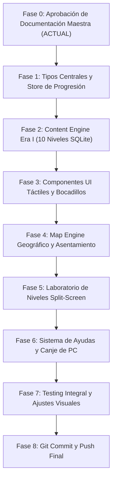

# LEARN-LAB — PLAN DE EJECUCIÓN TÉCNICA Y ARQUITECTURA
## Documento Maestro: 04_EJECUCION.md

---

# 1. AUDITORÍA TÉCNICA DEL CÓDIGO ACTUAL

Antes de iniciar cualquier refactorización, evaluamos con precisión los componentes existentes en el repositorio:

### Lo que se MANTIENE y APROVECHA (Activos de Calidad):
1. **Motor SQLite WASM (`src/lib/sql/engine.ts`):**
   - Sistema de inicialización en navegador con fallback automático a CDN oficial de `sql.js`.
   - Ejecución local en memoria, segura y sin dependencias de servidor.
2. **Traductor Inteligente de Errores SQL (`src/lib/sql/validator.ts`):**
   - Mapeo de errores crípticos de SQLite a explicaciones pedagógicas en español.
   - Validación heurística de palabras clave (`SELECT`, `WHERE`, `ORDER BY`).
3. **Mascota Nova Transparente (`public/mascot.png`):**
   - Artefacto procesado con fondo 100% transparente y anti-aliasing verificado.
4. **Setup Tecnológico:**
   - Next.js 14 / React 18, Tailwind CSS, Lucide Icons, TypeScript estricto.

### Lo que se REFACTORIZA y MEJORA:
1. **Estructura monolítica de niveles (`src/content/data-ai/sql/levels.ts`):**
   - Actualmente contiene 100 niveles básicos en un solo archivo.
   - **Mejora:** Desacoplar el contenido por Eras (`src/content/eras/era1_piedra.ts`, etc.) con esquemas tipados enriquecidos que incluyan diálogos, NPCs, objetivos de civilización, esquemas SQL reales y recompensas.
2. **Componente de Mapa:**
   - Actualmente renderiza botones con una imagen de fondo oscurecida por máscaras de opacidad y nodos que no coinciden con la geografía de la imagen.
   - **Mejora:** Implementar el `CivilizationMapEngine` con coordenadas normalizadas porcentuales `(x%, y%)`, trazado SVG con curvas bezier y el asentamiento evolutivo animado.
3. **Laboratorio de Niveles:**
   - Actualmente enfocado únicamente en el editor de código.
   - **Mejora:** Rediseñar la vista en split-screen interactivo donde Nova y el contexto narrativo conviven con el esquema vivo de tablas y el editor.
4. **Gestión de Estado:**
   - Centralizar la progresión, puntos de civilización, ayudas compradas y racha mediante un Store persistente (`useGameStore` con `localStorage`).

---

# 2. ARQUITECTURA DE SOFTWARE DEL NUEVO LEARN-LAB

```
src/
├── types/
│   ├── game.ts            # Tipos de Era, Nivel, Misión, Diálogos y Recompensas
│   └── sql.ts             # Tipos de Esquemas, Tablas, Resultados y Validación
├── stores/
│   └── useGameStore.ts    # Progresión del jugador, PC, inventario y estado del mapa
├── content/
│   └── eras/
│       ├── era1_piedra.ts # Vertical Slice: 10 niveles detallados con SQLite DDL/DML
│       ├── era2_fluvial.ts
│       └── index.ts       # Registro central de Eras
├── components/
│   ├── ui/                # Botones táctiles 3D, Badges de PC, Nubes de Diálogo
│   ├── game/
│   │   ├── MapEngine.tsx  # Capas de mapa: Fondo vivo, Camino SVG, Nodos, Nova
│   │   ├── Settlement.tsx # Asentamiento que evoluciona físicamente con el progreso
│   │   ├── NovaAvatar.tsx # Render de Nova con expresiones y micro-animaciones
│   │   └── SpeechBubble.tsx# Bocadillo de diálogo con puntero dinámico
│   └── lab/
│       ├── LevelLab.tsx   # Contenedor split-screen del ejercicio
│       ├── StoryPanel.tsx # Diálogo del NPC, objetivo pedagógico y visor de tablas
│       ├── CodeEditor.tsx # Editor con resaltado de sintaxis
│       └── ResultView.tsx # Tabla interactiva de resultados y traductor de errores
└── lib/
    └── sql/
        ├── engine.ts      # Motor SQLite WASM (Preservado)
        └── validator.ts   # Traductor de errores amigables (Preservado y extendido)
```

---

# 3. ESQUEMA DE DATOS Y TIPOS PRINCIPALES (`src/types/game.ts`)

```typescript
export interface DialogueLine {
  speaker: 'NOVA' | 'KAEL' | 'LYRA' | 'ORIN' | 'ADA' | 'EL_GLITCH';
  text: string;
  emotion?: 'curious' | 'happy' | 'thinking' | 'alert' | 'epic';
}

export interface TableSchema {
  tableName: string;
  columns: { name: string; type: string }[];
  initialData: Record<string, any>[];
}

export interface GameLevel {
  id: string;               // Ej: 'era1_1'
  eraId: string;            // 'era1'
  nodeNumber: number;       // 1 a 10
  title: string;            // 'El Primer Registro'
  subtitle: string;         // 'La Caverna del Despertar'
  coordinates: { x: number; y: number }; // Coordenadas % en el mapa (0 a 100)
  isBranch?: boolean;       // Si es un camino desafiante alternativo
  
  narrativeContext: string; // Explicación de la situación de la tribu
  learningObjective: string;// Concepto técnico a dominar
  
  entryDialogue: DialogueLine[];
  successDialogue: DialogueLine[];
  
  tables: TableSchema[];    // Tablas SQLite precargadas
  starterQuery: string;     // Plantilla con huecos para guiar al usuario
  expectedQuery: string;    // Query de referencia
  
  hints: {
    level1: string;         // Pista conceptual (costo: 5 PC)
    level2: string;         // Estructura sintáctica (costo: 15 PC)
  };
  
  rewards: {
    civilizationPoints: number;
    settlementUpgrade?: string; // Ej: 'choza_ramas', 'taller_silex'
    badgeId?: string;
  };
}
```

---

# 4. EL MAP ENGINE DINÁMICO (ESPECIFICACIÓN TÉCNICA)

El mapa se construye sobre un contenedor con relación de aspecto controlada (`aspect-[16/9]` o scroll vertical responsivo):

1. **Capa de Geografía e Ilustración:**
   - La imagen del bioma de la Era se muestra a todo color, con saturación viva (`saturate-110 brightness-105`), sin filtros oscuros que maten la inmersión.
2. **Capa de Camino SVG Vectorial:**
   - Un elemento `<svg className="absolute inset-0 w-full h-full pointer-events-none">` dibuja el camino con una curva cúbica bezier (`<path d="..." />`) que une los nodos exactamente en sus coordenadas `(x, y)`.
   - El trazo tiene un borde de sombra exterior y un patrón discontinuo que simula pisadas o piedras en el sendero.
3. **Capa de Nodos Interactivos:**
   - Cada nodo se posiciona con estilo `style={{ left: `${node.x}%`, top: `${node.y}%` }}`.
   - **Estados del Nodo:**
     - `COMPLETADO`: Icono de estrella dorada o gema de la era, clicable para revisitar.
     - `ACTUAL`: Nodo pulsante con halo de luz. Encima de este nodo se sitúa el avatar animado de **Nova**.
     - `BLOQUEADO`: Icono de candado de piedra o runa desactivada, con opacidad reducida.
4. **Capa de Asentamiento Evolutivo (`Settlement.tsx`):**
   - Una sección visible en el bioma donde un sprite o ilustración compuesta muestra el campamento creciendo: fogata $\rightarrow$ tiendas $\rightarrow$ empalizada $\rightarrow$ primera aldea.

---

# 5. EL SISTEMA DE ESTADO Y PROGRESIÓN (`useGameStore`)

Para garantizar que el progreso se mantenga intacto entre recargas del navegador:
- **Almacenamiento:** `localStorage` bajo la clave `learn_lab_save_v2`.
- **Estructura del Estado:**
  - `currentEra`: Identificador de la era activa (ej: `'era1'`).
  - `completedLevels`: Array con los IDs de niveles superados (ej: `['era1_1', 'era1_2']`).
  - `civilizationPoints`: Total de PC acumulados (ej: `420`).
  - `dailyStreak`: Racha de días de aprendizaje.
  - `unlockedUpgrades`: Mejoras del campamento desbloqueadas.
  - `purchasedHints`: Registro de ayudas ya compradas para no cobrar dos veces.

---

# 6. PLAN DE EJECUCIÓN EN FASES RIGUROSAS

Este es el orden estricto de implementación para transformar Learn-Lab sin romper funcionalidades existentes:



### Detalle de las Fases:

- **Fase 0 (Actual):** Creación de los 5 documentos maestros en `/docs/learn-lab/`. Presentación y validación con el usuario antes de tocar código.
- **Fase 1: Tipos y Estado Central**
  - Crear `src/types/game.ts` y `src/types/sql.ts`.
  - Crear `src/stores/useGameStore.ts` con persistencia en localStorage.
- **Fase 2: Content Engine (Vertical Slice Era I)**
  - Implementar los 10 niveles detallados con sus tablas de datos (`cuevas`, `mamuts`, `recursos_tribu`, `cazadores`) en `src/content/eras/era1_piedra.ts`.
- **Fase 3: Sistema de Diseño Visual**
  - Configurar tipografías amigables y paletas en Tailwind.
  - Crear componentes base: `TactileButton.tsx`, `SpeechBubble.tsx`, `CivilizationBadge.tsx`.
- **Fase 4: Map Engine y Asentamiento Evolutivo**
  - Implementar `MapEngine.tsx` con trazado Bezier SVG preciso.
  - Integrar a Nova en tamaño visible (~110px) sobre el nodo actual con micro-animaciones.
  - Renderizar la evolución del campamento nómada según los niveles completados.
- **Fase 5: Laboratorio de Niveles (Split Screen)**
  - Construir la vista de ejercicio donde conviven la historia/diálogos a la izquierda y el editor/resultados a la derecha.
  - Integrar el motor SQLite WASM para poblar las tablas de cada nivel al instante.
  - Conectar el traductor inteligente de errores en español.
- **Fase 6: Economía de Juego y Ayudas Pedagógicas**
  - Implementar la deducción de Puntos de Civilización al solicitar pistas conceptuales o estructurales.
  - Recompensar al usuario con PC y animaciones de celebración al resolver cada nivel.
- **Fase 7: Pruebas y Validación**
  - Probar los 10 niveles de la Era I de principio a fin asegurando que cada consulta esperada sea correcta y validada al 100%.
  - Verificar responsividad y rendimiento en dispositivos móviles y de escritorio.
- **Fase 8: Despliegue y Entrega**
  - Commit atómico y sincronización con el repositorio GitHub.
